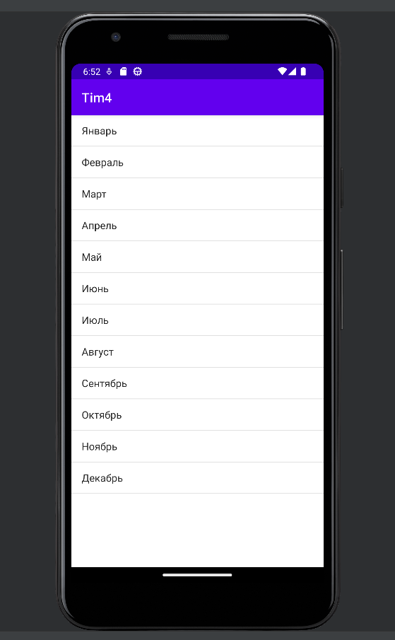

# Project4

private String readRawTextFile(Context context, int resId)
    {
        InputStream inputStream = context.getResources().openRawResource(resId);

        InputStreamReader inputReader = new InputStreamReader(inputStream);
        BufferedReader buffReader = new BufferedReader(inputReader);
        String line;
        StringBuilder builder = new StringBuilder();

        try {
            while ((line = buffReader.readLine()) !=null){
                builder.append(line);
                builder.append("\n");
            }
        }   catch (IOException e){
            return null;
        }
        return builder.toString();
    }
